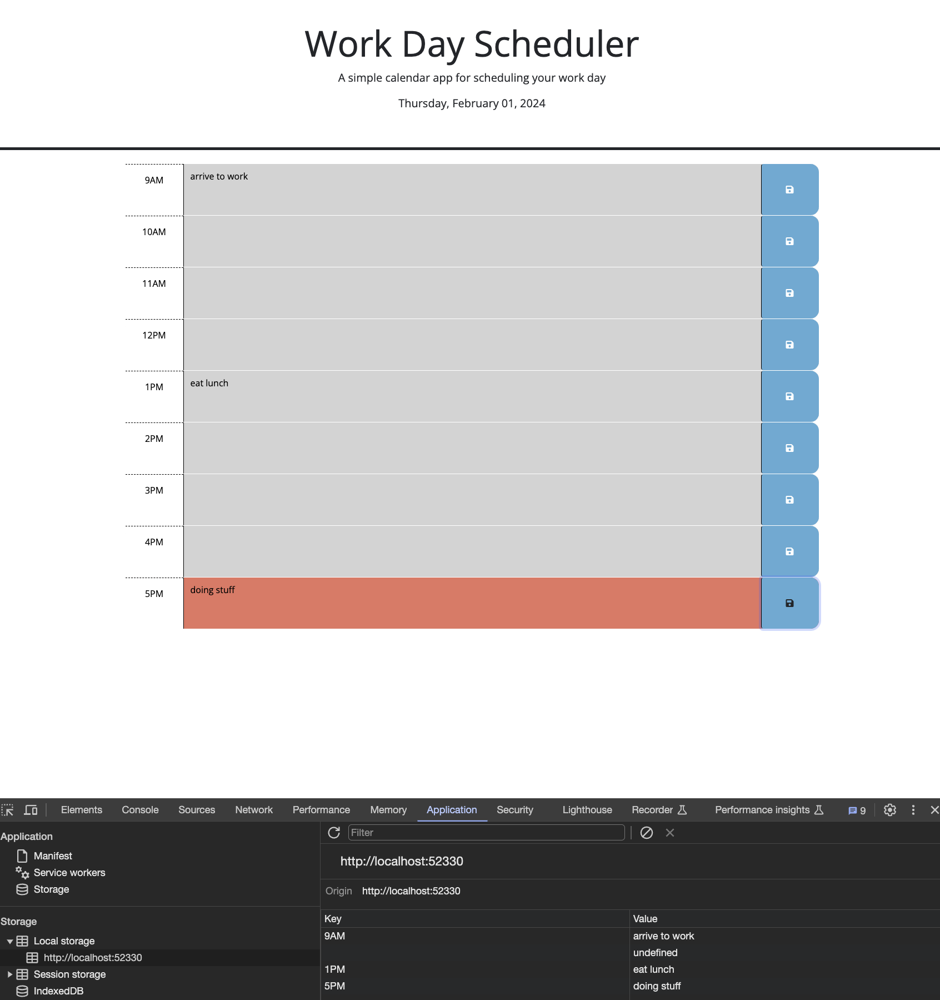

# Challenge: 5 Work Day Scheduler

Adding to starter code to create a work day scheduler

The purpose of this project was to create a word day scheduler from 9AM - 5PM. I was tasked with adding to starter code.

**Table of contents**

- [Motivation](#item-one)
- [What are the problems identified?](#item-two)
- [What are the solutions?](#item-three)
- [What was learned?](#item-four)
- [Usage](#item-five)
- [Credits](#item-six)
- [License](#item-seven)

---

### MOTIVATION

My motivation for making the timed code quiz was to see if I could implement the Javascript skills learned in my coding boot camp in the correct way. This challenge tested my ability to use JavaScript to build HTML, use day.js, and store user input and sibling element content to local storage.

### WHAT ARE THE PROBLEMS IDENTIFIED?

My starter code had comments that included instruction and hints. I also followed acceptnce criteria to problem solve and come to a solution. My problems were:

- How do I create HTML in Javascript?
- How do I use day.js to put a live clock on my work day scheduler so a user can view it at the top of the page?
- How do I use day.js to make my hour time-blocks change color based on if it is the past, present, or futures?
- How do I get my hour time-blocks to display the hour the time to the hour, as well as a save button and button icon?
- How do I save user input in a textarea field and the hour identifier of that specific textarea to local storage?

### WHAT ARE THE SOLUTIONS?

- Solution to creating HTML in Javascript: I used Jquery to build and append elements of HTML.
- Solution to using day.js: I formated day.js correctly and displayed it at the top of the webpage. I compared the current time to the hourblock of each div and made it have a class of past, present or future. These classes were premade in the CSS starter code and contained colors that made the time-blocks change to a specific color based on the current time.
- Solution to getting time-blocks to display correct content: In JavaScript I appended elements using Jquery.
- Solution to saving correct information to local storage: I used event.target to find the button clicked and the this() object so that when the user typed in content of a specific time-block's textarea, the corresponding hour label was sent to local storage.
  

### WHAT WAS LEARNED?

I learned how to use and format day.js, create elements in JavaScript using Jquery, and learned hot to use this() to target elements / DOM traversal.

### USAGE

The deployed page through GitHub can be found at the following [link](https://alexahnbaum.github.io/Challenge_5_-Work_Day_Scheduler/)

### CREDITS

During the course of this challenge, I worked with my bootcamp classmate Keegan Royale-Eisenberg, reviewed class content, and went to office hours to get advice/guidance from my boot camp professor, John Young

### LICENSE

MIT License

Copyright (c) 2023 alexahnbaum

Permission is hereby granted, free of charge, to any person obtaining a copy
of this software and associated documentation files (the "Software"), to deal
in the Software without restriction, including without limitation the rights
to use, copy, modify, merge, publish, distribute, sublicense, and/or sell
copies of the Software, and to permit persons to whom the Software is
furnished to do so, subject to the following conditions:

The above copyright notice and this permission notice shall be included in all
copies or substantial portions of the Software.

THE SOFTWARE IS PROVIDED "AS IS", WITHOUT WARRANTY OF ANY KIND, EXPRESS OR
IMPLIED, INCLUDING BUT NOT LIMITED TO THE WARRANTIES OF MERCHANTABILITY,
FITNESS FOR A PARTICULAR PURPOSE AND NONINFRINGEMENT. IN NO EVENT SHALL THE
AUTHORS OR COPYRIGHT HOLDERS BE LIABLE FOR ANY CLAIM, DAMAGES OR OTHER
LIABILITY, WHETHER IN AN ACTION OF CONTRACT, TORT OR OTHERWISE, ARISING FROM,
OUT OF OR IN CONNECTION WITH THE SOFTWARE OR THE USE OR OTHER DEALINGS IN THE
SOFTWARE.
